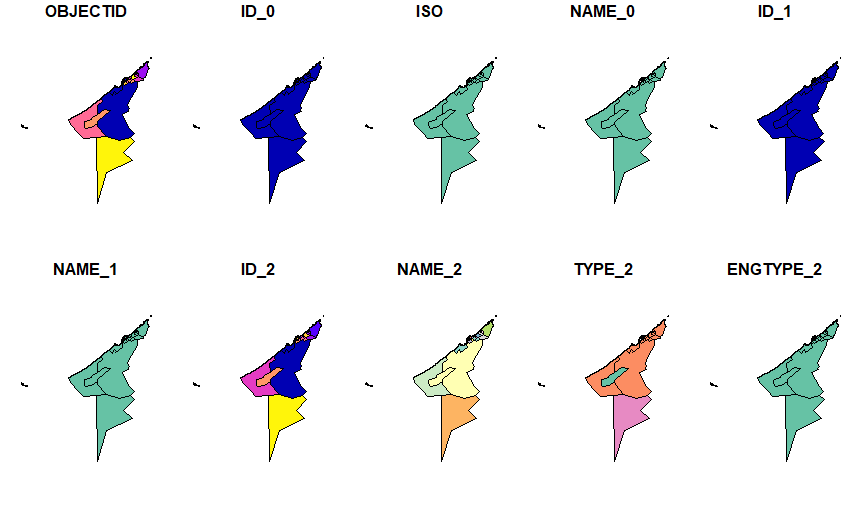
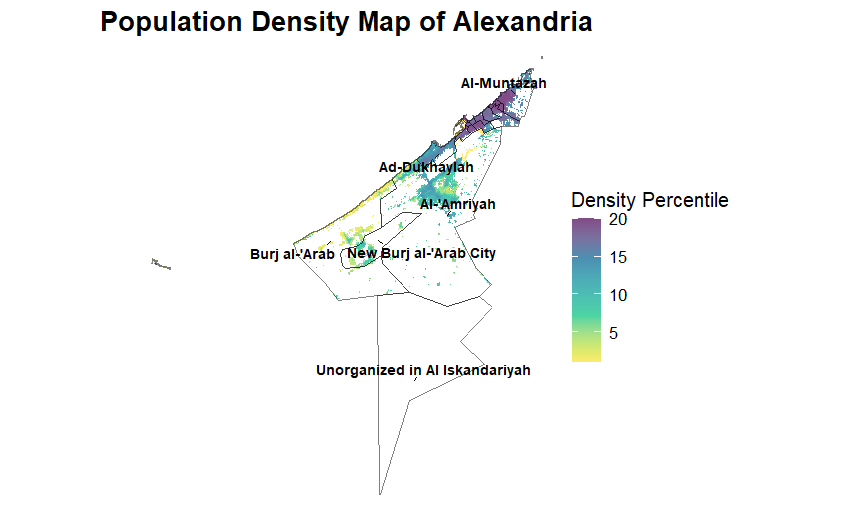

# Population Density Map of Alexandria

This project visualizes population density in Alexandria using spatial data processing in R. The analysis leverages GIS techniques to read, transform, and map geospatial data.

## Features
- Reads and processes a **TIFF** file containing population density data.
- Converts raster data to an **sf object** for spatial analysis.
- Creates a percentile-based color map using the **viridis** color palette.
- Overlays administrative boundaries from a **shapefile**.
- Adds labeled regions for better readability.

## Requirements
Ensure the following R packages are installed:
```r
install.packages(c("sf", "tidyverse", "viridis", "stars", "ggrepel"))
```

## Data Files
- **Alexandria_population.tif**: Population density raster file.
- **Alexandria.shp**: Shapefile containing administrative boundaries.

## Usage
Run the R script to generate the population density map:
```r
source("Alexandria_Population_Map.R")
```

## Output
### Initial SF Object Plot
The default plot of an `sf` object shows multiple attributes:


### Final Population Density Map
The final output map, enhanced with boundaries and labels:



